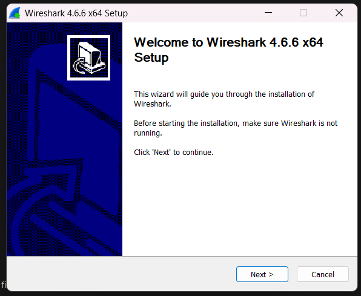
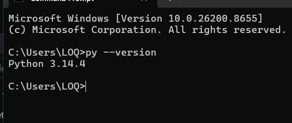

# Laporan Praktikum Jaringan Komputer
## Modul 1: Persiapan dan Instalasi Tools

**Identitas Praktikan:**
* **Nama Lengkap:** Didit Septa Putra
* **NIM:** 103072400071
* **Program Studi:** Informatika
* **Fakultas:** Informatika
* **Perguruan Tinggi:** Universitas Telkom Surabaya
* **Tahun Akademik:** 2026

---

### A. Tujuan Pelaksanaan Praktikum
Praktikum Modul 1 ini bertujuan untuk melakukan persiapan awal perkuliahan. Mahasiswa diharapkan dapat memastikan seluruh *software* dan perangkat pendukung praktikum Jaringan Komputer, khususnya **Wireshark** dan **Python**, telah diunduh, terpasang, dan dapat dijalankan dengan baik pada komputer lokal masing-masing.

### B. Instalasi Wireshark
Wireshark dikenal sebagai perangkat lunak penganalisis lalu lintas dan protokol jaringan (*network protocol analyzer*). 
1. Tahap pertama adalah mengunduh berkas instalasi dari situs resminya melalui tautan: [http://www.wireshark.org/](http://www.wireshark.org/).
2. Setelah unduhan selesai, jalankan *installer* tersebut. Proses instalasi cukup mudah, yakni dengan mengikuti panduan *wizard* yang muncul di layar (menekan tombol *Next* terus hingga mencapai *Finish*).
3. Berikut adalah dokumentasi saat proses instalasi Wireshark berlangsung:



### C. Instalasi dan Pengujian Python
1. Perangkat lunak Python dapat diperoleh dengan mengunduhnya secara gratis melalui situs web resmi: [https://www.python.org/downloads/](https://www.python.org/downloads/).
2. Setelah diinstal, kita perlu memastikan bahwa Python sudah terintegrasi ke dalam *environment variables* di sistem Windows. 
3. Langkah pengujian dilakukan dengan membuka aplikasi **Command Prompt (CMD)** dan menjalankan perintah sederhana berikut:
   ```cmd
   py --version
   ```
4. Jika instalasi berhasil dan sistem mengenali perintah tersebut, CMD akan mengembalikan informasi mengenai versi Python yang terpasang, seperti yang terlihat pada gambar pengujian di bawah ini:



### D. Kesimpulan
Melalui praktikum Modul 1 ini, dapat disimpulkan bahwa tahap persiapan merupakan langkah krusial sebelum memulai eksperimen jaringan komputer yang lebih mendalam. Dengan terinstalnya **Wireshark** dan **Python**, perangkat komputer lokal telah siap digunakan untuk melakukan analisis protokol jaringan serta mengeksekusi berbagai skrip otomatisasi jaringan di pertemuan-pertemuan selanjutnya.
