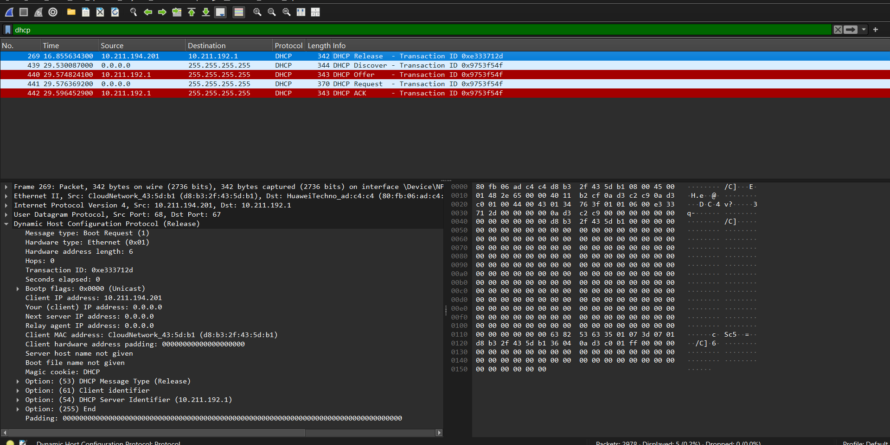
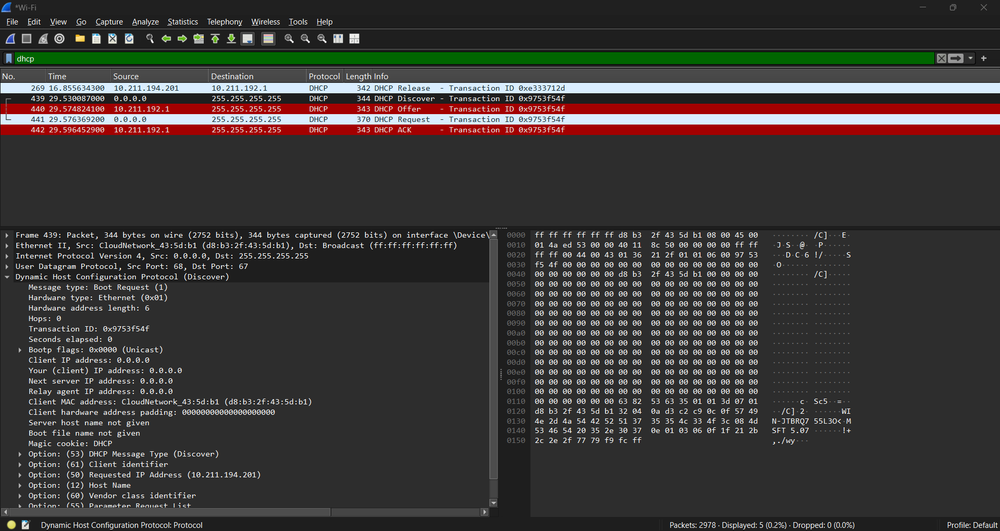
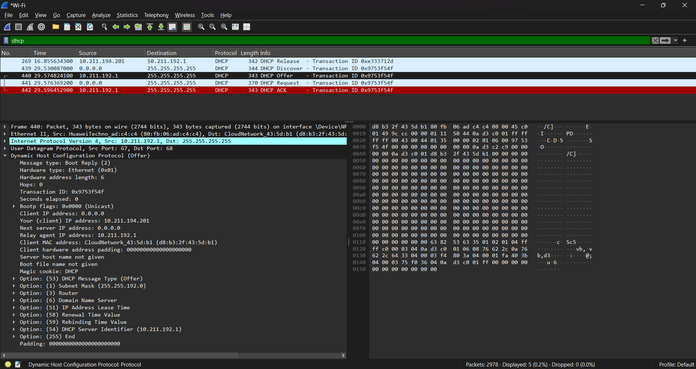
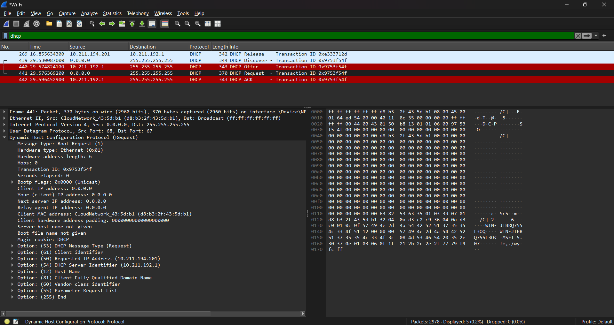
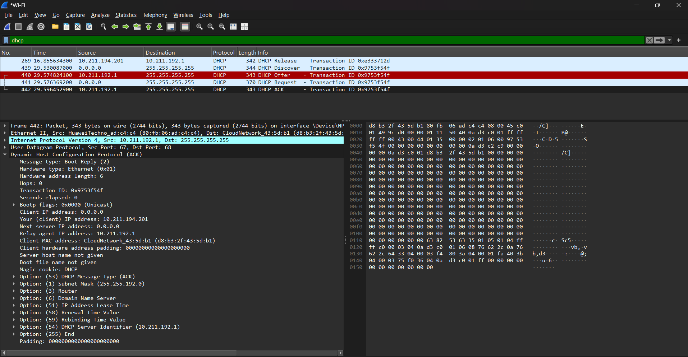

# Laporan Praktikum Jaringan Komputer - Modul 11
## DHCP (Dynamic Host Configuration Protocol)

> **Semester Genap 2025/2026 | Fakultas Informatika | Universitas Telkom**

---

### Identitas Praktikan

## **Nama Lengkap** Muhammad Chaesar Pratama
## **NIM** 103072400119
## **Kelas** IF-04-01

---

## 1. Tujuan Praktikum

### 1. Menginvestigasi cara kerja protokol DHCP
Mahasiswa dapat menginvestigasi cara kerja protokol DHCP menggunakan Wireshark

### 2. Mengumpulkan jejak paket DHCP
Mampu melakukan capture terhadap empat jenis pesan DHCP (Discover, Offer, Request, ACK)

### 3. Menganalisis struktur pesan DHCP
Memahami isi field-field pada setiap pesan DHCP yang ditangkap

---

## 2. Dasar Teori

### 2.1 Pengertian DHCP

DHCP (Dynamic Host Configuration Protocol) adalah protokol yang digunakan secara luas di perusahaan, universitas, dan LAN kabel maupun nirkabel jaringan rumah untuk secara dinamis menetapkan alamat IP ke host, serta untuk mengkonfigurasi informasi konfigurasi jaringan lainnya seperti subnet mask, default gateway, dan DNS server.

DHCP bekerja pada model **client-server**, di mana DHCP server bertugas mengelola dan mendistribusikan alamat IP kepada DHCP client yang terhubung ke jaringan.

### 2.2 Proses DORA pada DHCP

Proses pemberian alamat IP oleh DHCP server kepada client dikenal dengan istilah **DORA**, yang terdiri dari empat jenis pesan utama:

| Pesan | Pengirim | Tipe Pengiriman | Keterangan |
|-------|----------|-----------------|-------------|
| **DHCP Discover** | Client | Broadcast | Client mencari DHCP server yang tersedia di jaringan |
| **DHCP Offer** | Server | Broadcast/Unicast | Server menawarkan alamat IP yang tersedia kepada client |
| **DHCP Request** | Client | Broadcast | Client meminta/mengkonfirmasi alamat IP yang ditawarkan |
| **DHCP ACK** | Server | Broadcast/Unicast | Server mengonfirmasi dan menyelesaikan proses pemberian alamat IP |

### 2.3 Karakteristik Pesan DHCP

| Karakteristik | Discover & Offer | Request & ACK |
|--------------|-------------------|----------------|
| **Kapan terjadi** | Saat client mencari alamat IP baru | Saat konfirmasi alamat IP (baru atau perpanjangan sewa) |
| **Port yang digunakan** | UDP 67 (server), UDP 68 (client) | UDP 67 (server), UDP 68 (client) |
| **Tipe pesan** | Broadcast (alamat tujuan belum diketahui) | Bisa broadcast maupun unicast |

### 2.4 Field Penting pada Paket DHCP

| Field | Keterangan |
|-------|-------------|
| **Transaction ID (xid)** | Nomor unik untuk mencocokkan request dan response pada satu transaksi |
| **Your (client) IP Address** | Alamat IP yang ditawarkan/diberikan kepada client |
| **Client MAC Address** | Alamat fisik (MAC) dari perangkat client |
| **Option: DHCP Message Type** | Menunjukkan jenis pesan (Discover/Offer/Request/ACK) |
| **Option: IP Address Lease Time** | Durasi waktu client boleh menggunakan alamat IP tersebut |
| **Option: Subnet Mask** | Subnet mask yang diberikan kepada client |
| **Option: Router** | Alamat default gateway yang diberikan kepada client |
| **Option: Domain Name Server** | Alamat DNS server yang diberikan kepada client |

---

## 3. Praktikum Capture DHCP dengan Wireshark

### 3.1 Tujuan Pengumpulan Jejak Paket

Pengumpulan jejak paket dilakukan dengan cara melepas (release) konfigurasi IP yang sedang digunakan, kemudian meminta (renew) alamat IP baru, sehingga keempat jenis pesan DHCP (Discover, Offer, Request, ACK) dapat tertangkap oleh Wireshark.

### 3.2 Langkah-Langkah pada Windows (PC)

1. Buka **Command Prompt** sebagai Administrator
2. Jalankan perintah berikut untuk melepas alamat IP yang sedang digunakan:
   ```
   ipconfig /release
   ```
3. Buka **Wireshark**, pilih interface jaringan yang aktif (misalnya Wi-Fi atau Ethernet), lalu mulai **capture**
4. Kembali ke Command Prompt, jalankan perintah berikut untuk meminta alamat IP baru:
   ```
   ipconfig /renew
   ```
5. Tunggu beberapa detik hingga proses selesai
6. Hentikan (**stop**) capture pada Wireshark
7. Pada kolom filter Wireshark, masukkan filter tampilan:
   ```
   dhcp
   ```
8. Pastikan keempat pesan (Discover, Offer, Request, ACK) muncul pada hasil capture

### 3.3 Hasil Capture DHCP



Gambar di atas menunjukkan hasil capture Wireshark dengan filter `dhcp` yang menampilkan rangkaian pesan: DHCP Release (saat `ipconfig /release` dijalankan), kemudian diikuti oleh DHCP Discover, DHCP Offer, DHCP Request, dan DHCP ACK (saat `ipconfig /renew` dijalankan). Keempat pesan DORA terlihat memiliki Transaction ID yang sama, menandakan keempatnya merupakan satu transaksi peminjaman alamat IP yang sama.

Penjelasan hasil capture:
- Pesan **DHCP Discover** dikirim oleh client secara broadcast untuk mencari DHCP server
- Pesan **DHCP Offer** dikirim oleh server sebagai tanggapan, menawarkan sebuah alamat IP
- Pesan **DHCP Request** dikirim oleh client untuk meminta/mengonfirmasi alamat IP yang ditawarkan
- Pesan **DHCP ACK** dikirim oleh server untuk menyelesaikan proses dan mengonfirmasi alamat IP final

---

## 4. Analisis Paket DHCP

### 4.1 Analisis Pesan DHCP Discover




| Field | Nilai |
|-------|-------|
| Transaction ID | 0x9753f54f |
| Client MAC Address | d8:b3:2f:43:5d:b1 |
| Your (client) IP Address | 0.0.0.0 |
| DHCP Message Type | 1 (Discover) |

**Analisis:** Pesan ini dikirim oleh client ke alamat broadcast karena client belum memiliki informasi mengenai keberadaan DHCP server pada jaringan tersebut.

### 4.2 Analisis Pesan DHCP Offer




| Field | Nilai |
|-------|-------|
| Transaction ID | 0x9753f54f |
| Your (client) IP Address | 10.211.194.201 |
| DHCP Message Type | 2 (Offer) |
| IP Address Lease Time | Terdapat pada Option (51) |

**Analisis:** Server merespons dengan menawarkan satu alamat IP yang tersedia dari address pool yang dimilikinya. Transaction ID pada paket ini sama dengan Transaction ID pada paket Discover, menandakan keduanya satu transaksi yang sama.

### 4.3 Analisis Pesan DHCP Request




| Field | Nilai |
|-------|-------|
| Transaction ID | 0x9753f54f |
| Requested IP Address | 10.211.194.201 |
| DHCP Message Type | 3 (Request) |

**Analisis:** Client mengirimkan pesan secara broadcast untuk mengonfirmasi penerimaan alamat IP yang ditawarkan server. Pengiriman tetap berupa broadcast karena bisa terdapat lebih dari satu DHCP server yang memberikan offer.

### 4.4 Analisis Pesan DHCP ACK




| Field | Nilai |
|-------|-------|
| Transaction ID | 0x9753f54f |
| Your (client) IP Address | 10.211.194.201 |
| DHCP Message Type | 5 (ACK) |
| Subnet Mask | 255.255.192.0 |
| Router | Terdapat pada Option (3) |
| Domain Name Server | Terdapat pada Option (6) |

**Analisis:** Server mengonfirmasi pemberian alamat IP secara final kepada client beserta parameter konfigurasi jaringan tambahan seperti subnet mask, default gateway, dan DNS server.

---

## 5. Perbandingan Keempat Pesan DHCP

| Aspek | Discover | Offer | Request | ACK |
|-------|----------|-------|---------|-----|
| **Pengirim** | Client | Server | Client | Server |
| **Tipe Pengiriman** | Broadcast | Broadcast/Unicast | Broadcast | Broadcast/Unicast |
| **Tujuan** | Mencari DHCP server | Menawarkan IP | Konfirmasi permintaan IP | Finalisasi pemberian IP |
| **Berisi alamat IP final** | Tidak (0.0.0.0) | Ya (ditawarkan) | Tidak (hanya requested) | Ya (final) |

---

## 6. Kesimpulan

Berdasarkan praktikum yang telah dilakukan, dapat disimpulkan bahwa:

1. DHCP bekerja melalui empat tahap pesan yang dikenal sebagai proses **DORA**: Discover, Offer, Request, dan Acknowledgement (ACK)
2. Proses Discover dan Request dilakukan oleh client secara **broadcast**, karena pada tahap tersebut client belum mengetahui dengan pasti keberadaan atau alamat dari DHCP server
3. **Transaction ID** digunakan untuk memastikan bahwa pesan-pesan yang saling berkaitan (Discover-Offer-Request-ACK) berasal dari satu transaksi peminjaman alamat IP yang sama
4. Selain alamat IP, server DHCP juga memberikan informasi konfigurasi tambahan seperti **subnet mask**, **default gateway (router)**, **DNS server**, dan **lease time** melalui pesan ACK
5. Penggunaan Wireshark memudahkan dalam memvisualisasikan dan memverifikasi setiap tahapan komunikasi protokol DHCP secara langsung pada lalu lintas jaringan

---
