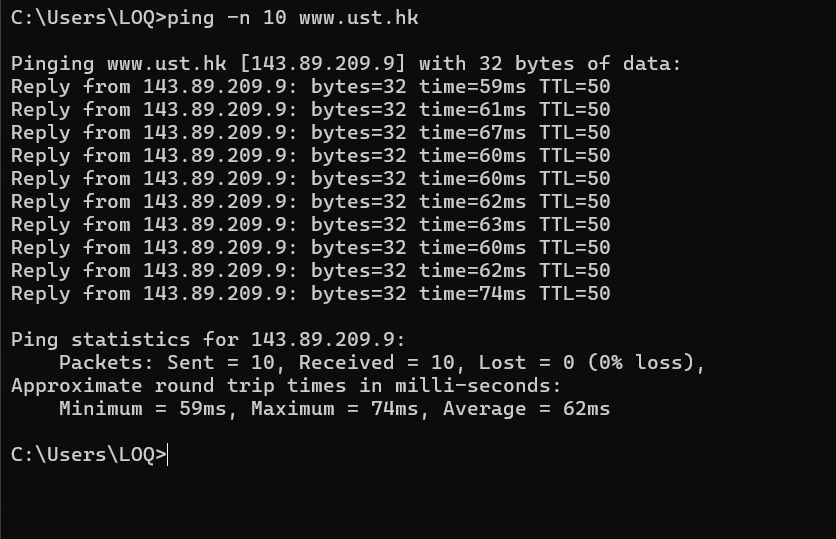
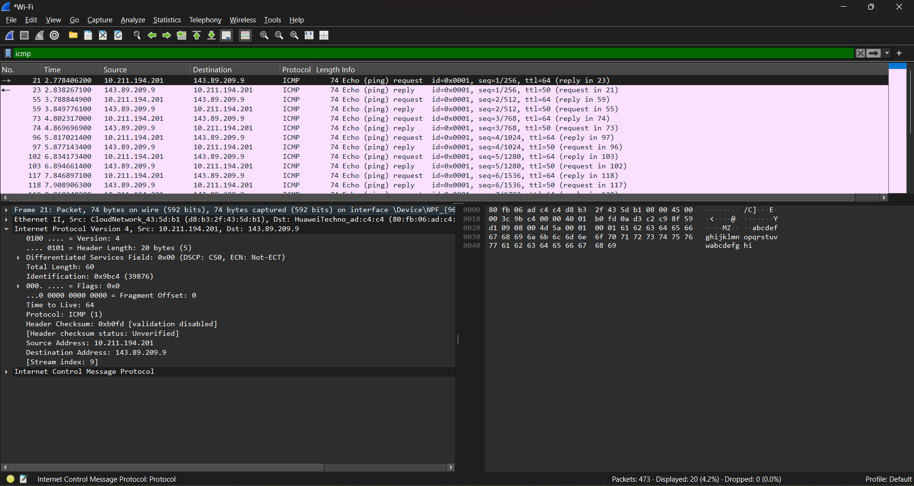
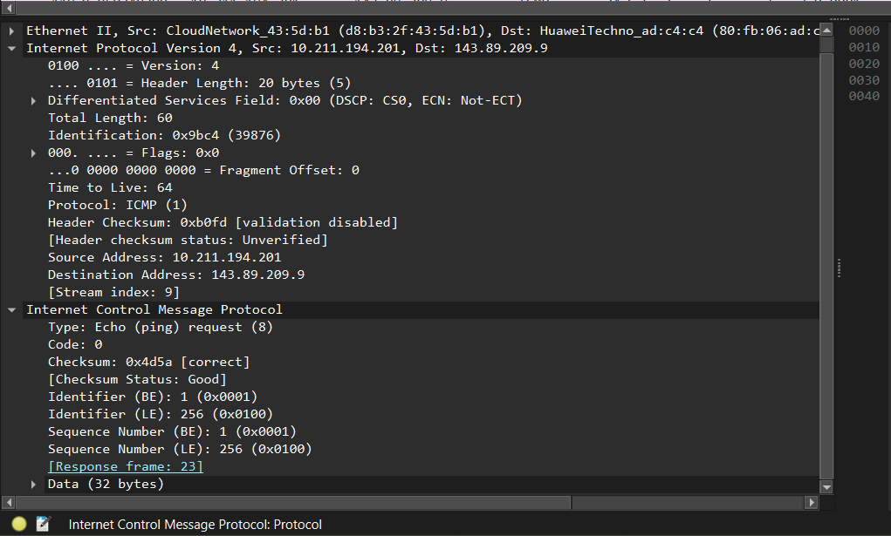
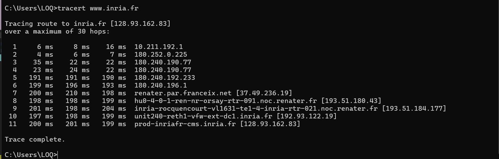
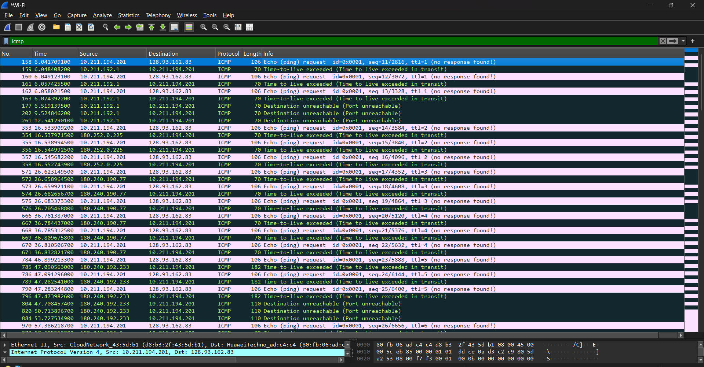

# Laporan Praktikum Jaringan Komputer - Modul 12
## ICMP (Internet Control Message Protocol)

> **Semester Genap 2025/2026 | Fakultas Informatika | Universitas Telkom**

---

### Identitas Praktikan

## **Nama Lengkap** Muhammad Chaesar Pratama
## **NIM** 103072400119
## **Kelas** IF-04-01

---

## 1. Tujuan Praktikum

### 1. Menginvestigasi cara kerja protokol ICMP
Mahasiswa dapat menginvestigasi cara kerja protokol ICMP menggunakan Wireshark

### 2. Memahami program ICMP Pinger
Mahasiswa dapat memahami cara kerja program berbasis ICMP seperti Ping dan Traceroute

### 3. Menganalisis format pesan ICMP
Memahami format dan isi pesan ICMP pada hasil capture Wireshark

---

## 2. Dasar Teori

### 2.1 Pengertian ICMP

ICMP (Internet Control Message Protocol) adalah protokol pada layer network yang digunakan untuk mengirimkan pesan kontrol dan pesan kesalahan (error reporting) antar perangkat di jaringan IP. ICMP tidak digunakan untuk mengirimkan data pengguna seperti TCP atau UDP, melainkan untuk keperluan diagnostik dan pelaporan status jaringan.

Nomor protokol ICMP pada header IP adalah **01**, yang menandakan bahwa muatan (payload) dari datagram IP tersebut merupakan paket ICMP.

### 2.2 Tipe dan Kode ICMP yang Umum Digunakan

| Tipe | Kode | Nama | Keterangan |
|------|------|------|-------------|
| 8 | 0 | Echo Request | Dikirim oleh program Ping ke host tujuan |
| 0 | 0 | Echo Reply | Dikirim oleh host tujuan sebagai balasan Echo Request |
| 11 | 0 | Time Exceeded (TTL Exceeded) | Dikirim oleh router ketika nilai TTL paket mencapai 0 |
| 3 | 0-15 | Destination Unreachable | Dikirim ketika host/port/jaringan tujuan tidak dapat dijangkau |

### 2.3 Program Ping

Ping adalah program sederhana yang digunakan untuk memverifikasi apakah sebuah host pada jaringan aktif (reachable) atau tidak. Cara kerjanya:

1. Host sumber mengirimkan paket **ICMP Echo Request** (Tipe 8, Kode 0) ke alamat IP tujuan
2. Jika host tujuan aktif, host tujuan akan mengirimkan kembali paket **ICMP Echo Reply** (Tipe 0, Kode 0) ke host sumber
3. Host sumber menghitung **Round-Trip Time (RTT)**, yaitu selisih waktu antara pengiriman Echo Request dan penerimaan Echo Reply

Paket ICMP Echo Request/Reply memiliki field tambahan berupa **identifier** dan **sequence number**, yang digunakan untuk mencocokkan setiap request dengan reply yang bersesuaian.

### 2.4 Program Traceroute

Traceroute digunakan untuk mengetahui jalur (rute) yang dilalui sebuah paket dari host sumber ke host tujuan, termasuk daftar router yang dilewati di sepanjang jalur tersebut.

Cara kerja Traceroute memanfaatkan field **Time To Live (TTL)** pada header IP:

| Sistem Operasi | Paket yang Dikirim | Mekanisme |
|-----------------|---------------------|-----------|
| Unix/Linux/MacOS | UDP dengan port tujuan tidak valid | Router mengirim ICMP error saat TTL habis |
| Windows | ICMP Echo Request | Router mengirim ICMP error saat TTL habis |

Proses Traceroute:

1. Paket pertama dikirim dengan **TTL = 1**. Begitu mencapai router pertama, TTL dikurangi menjadi 0, sehingga router tersebut mengirim balik pesan **ICMP Time Exceeded** ke sumber
2. Paket kedua dikirim dengan **TTL = 2**, mencapai router kedua sebelum TTL habis, dan seterusnya
3. Proses berulang dengan TTL yang terus bertambah hingga paket berhasil mencapai host tujuan
4. Pada umumnya, untuk setiap nilai TTL dikirimkan **3 paket probe**, sehingga dapat dihitung RTT rata-rata menuju setiap router pada jalur tersebut

---

## 3. Praktikum ICMP dengan Ping

### 3.1 Langkah-Langkah Capture Ping

1. Buka **Command Prompt**
2. Jalankan **Wireshark**, pilih interface jaringan aktif, lalu mulai **capture**
3. Pada Command Prompt, jalankan perintah:
   ```
   ping -n 10 www.ust.hk
   ```
   (atau host lain yang berada di benua berbeda, agar RTT lebih terlihat signifikan; argumen `-n 10` berarti mengirim 10 pesan ping)
4. Tunggu hingga proses ping selesai (10 paket terkirim dan diterima)
5. Hentikan (**stop**) capture di Wireshark
6. Pada kolom filter Wireshark, masukkan:
   ```
   icmp
   ```

### 3.2 Hasil Command Prompt




*Screenshot jendela Command Prompt setelah perintah ping selesai dijalankan, menampilkan jumlah paket terkirim/diterima serta statistik RTT (minimum, maximum, average).*

### 3.3 Hasil Capture Wireshark (Filter ICMP)




*Screenshot daftar paket Wireshark dengan filter "icmp", menampilkan 20 paket: 10 ICMP Echo Request yang dikirim oleh sumber dan 10 ICMP Echo Reply yang diterima dari host tujuan.*

### 3.4 Analisis Paket IP pada Ping




*Screenshot detail paket pertama (Echo Request) dengan bagian "Internet Protocol Version 4" di-expand.*

| Field | Nilai |
|-------|-------|
| Source Address | 10.211.194.201 |
| Destination Address | 143.89.209.9 |
| Protocol | 1 (ICMP) |

**Analisis:** Nomor protokol pada header IP bernilai 1, yang menunjukkan bahwa payload dari datagram IP ini adalah paket ICMP.

### 3.5 Analisis Paket ICMP pada Ping


*Screenshot detail paket dengan bagian "Internet Control Message Protocol" di-expand.*

| Field | Nilai |
|-------|-------|
| Type | 8 (Echo (ping) request) |
| Code | 0 |
| Checksum | 0x4d5a [correct] |
| Identifier | 1 (0x0001) |
| Sequence Number | 1 (0x0001) |

**Analisis:** Paket yang dikirim oleh host sumber merupakan ICMP Echo Request (Tipe 8, Kode 0), sedangkan balasan dari host tujuan merupakan ICMP Echo Reply (Tipe 0, Kode 0). Identifier dan sequence number digunakan untuk mencocokkan setiap pasangan request-reply.

---

## 4. Praktikum ICMP dengan Traceroute

### 4.1 Langkah-Langkah Capture Traceroute

1. Buka **Command Prompt**
2. Jalankan **Wireshark**, pilih interface jaringan aktif, lalu mulai **capture**
3. Pada Command Prompt, jalankan perintah:
   ```
   tracert www.inria.fr
   ```
   (atau host lain di benua berbeda)
4. Tunggu hingga proses traceroute selesai
5. Hentikan (**stop**) capture di Wireshark
6. Pada kolom filter Wireshark, masukkan:
   ```
   icmp
   ```

### 4.2 Hasil Command Prompt




*Screenshot jendela Command Prompt yang menampilkan hasil tracert, berupa daftar hop (router) yang dilalui beserta RTT dari 3 paket probe pada setiap hop, serta alamat IP/nama router yang mengembalikan pesan ICMP TTL-exceeded.*

### 4.3 Hasil Capture Wireshark (Filter ICMP)




*Screenshot daftar paket Wireshark dengan filter "icmp" untuk traceroute, menampilkan paket-paket ICMP yang dikirim dengan nilai TTL bertingkat serta paket error ICMP Time Exceeded dari tiap router.*

### 4.4 Analisis Paket Error ICMP (Time Exceeded)


*Screenshot detail salah satu paket ICMP error yang dikembalikan oleh router, dengan bagian ICMP di-expand.*

| Field | Nilai |
|-------|-------|
| Type | 11 (Time-to-live exceeded) |
| Code | 0 (Time to live exceeded in transit) |
| Source Address (pengirim error) | 10.211.192.1 |

**Analisis:** Paket error ICMP ini memiliki lebih banyak field dibandingkan paket Ping biasa, karena ICMP error menyertakan sebagian dari header dan payload paket asli yang menyebabkan error tersebut (untuk membantu host sumber mengidentifikasi paket mana yang gagal terkirim).

---

## 5. Perbandingan Ping dan Traceroute

| Aspek | Ping | Traceroute |
|-------|------|------------|
| **Tujuan** | Memverifikasi host aktif/tidak | Mengetahui jalur/rute ke host tujuan |
| **Paket yang dikirim** | ICMP Echo Request | ICMP Echo Request (Windows) / UDP (Unix/Linux) |
| **Paket balasan** | ICMP Echo Reply | ICMP Time Exceeded (per hop) hingga ICMP Echo Reply/Port Unreachable (hop akhir) |
| **Penggunaan TTL** | TTL tetap (default) | TTL bertambah bertahap (1, 2, 3, ...) |
| **Informasi yang didapat** | Status host & RTT | Daftar router yang dilalui & RTT per hop |

---

## 6. Kesimpulan

Berdasarkan praktikum yang telah dilakukan, dapat disimpulkan bahwa:

1. ICMP digunakan untuk mengirimkan pesan kontrol dan pesan kesalahan pada jaringan IP, dengan nomor protokol **1** pada header IP
2. Program **Ping** bekerja dengan mengirimkan pesan **ICMP Echo Request (Tipe 8)** dan menerima **ICMP Echo Reply (Tipe 0)**, serta menghitung **Round-Trip Time (RTT)** dari setiap paket
3. Program **Traceroute** memanfaatkan mekanisme **TTL (Time To Live)** yang bertambah secara bertahap untuk memetakan jalur router yang dilalui paket hingga mencapai tujuan
4. Setiap kali TTL paket mencapai nol di sebuah router, router tersebut akan mengirimkan pesan **ICMP Time Exceeded (Tipe 11)** kembali ke sumber
5. Paket error ICMP (seperti Time Exceeded) memiliki field yang lebih banyak dibandingkan paket Echo Request/Reply, karena turut menyertakan sebagian header dan data dari paket asli yang menyebabkan error
6. Implementasi Traceroute berbeda antara Windows (menggunakan ICMP) dan Unix/Linux/MacOS (menggunakan UDP), namun keduanya memanfaatkan prinsip TTL yang sama

---