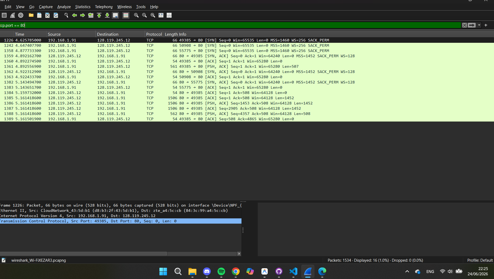
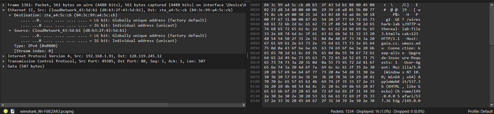
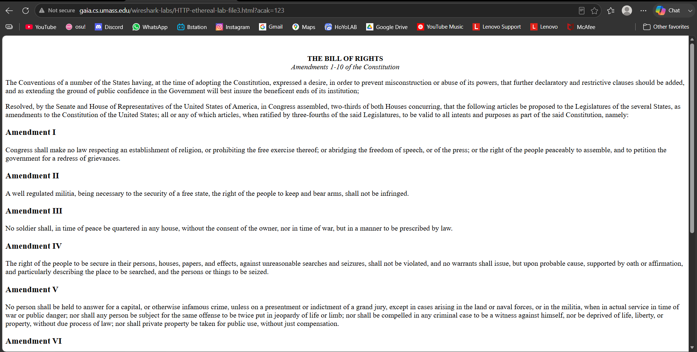
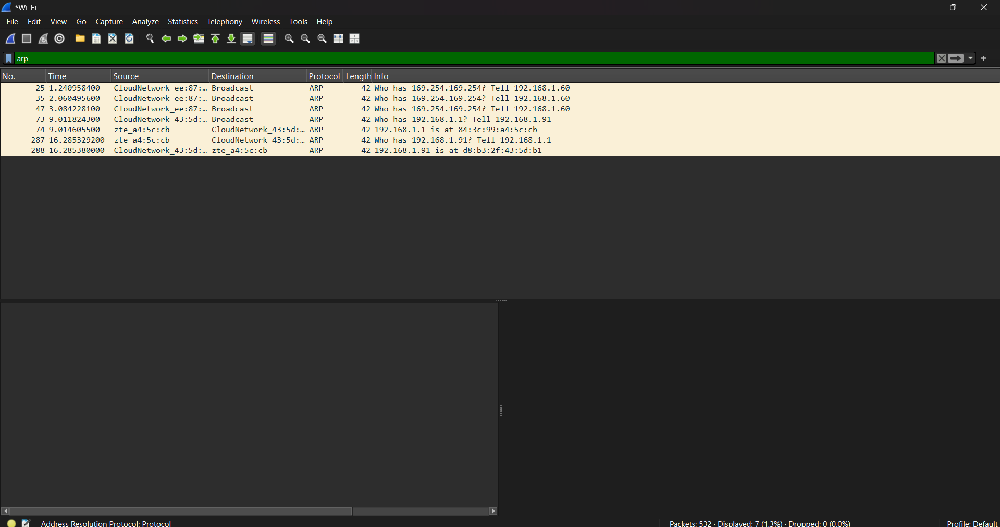

# Laporan Praktikum Jaringan Komputer - Modul 13
## Ethernet and ARP

> **Semester Genap 2025/2026 | Fakultas Informatika | Universitas Telkom**

---

### Identitas Praktikan

## **Nama Lengkap** Muhammad Chaesar Pratama
## **NIM** 103072400119
## **Kelas** IF-04-01

---

## 1. Tujuan Praktikum

### 1. Menginvestigasi cara kerja Ethernet dan ARP
Mahasiswa dapat menginvestigasi cara kerja Ethernet dan ARP menggunakan Wireshark.

---

## 2. Dasar Teori (Pengantar)

Di lab ini, dilakukan penyelidikan terhadap protokol Ethernet dan protokol ARP. RFC 826 berisi detail dari protokol ARP, yang digunakan oleh perangkat IP untuk menentukan alamat IP dari antarmuka jarak jauh yang alamat Ethernetnya diketahui.

---

## 3. Menangkap dan Menganalisis Frame Ethernet

### 3.1 Langkah Kerja
1. Kosongkan cache browser.
2. Mulai *sniffer* paket Wireshark.
3. Akses URL `http://gaia.cs.umass.edu/wireshark-labs/HTTP-ethereal-lab-file3.html` di browser.
4. Hentikan penangkapan paket Wireshark.
5. Filter paket dengan memilih *Analyze -> Enabled Protocols* dan hapus centang pada IP agar hanya menampilkan protokol di bawah IP.

### 3.2 Pesan HTTP GET pada Ethernet

*Screenshot tangkapan Wireshark yang menampilkan baris pesan HTTP GET dari komputer ke gaia.cs.umass.edu.*

**Analisis:**
Berdasarkan hasil tangkapan di atas, dapat dilihat bahwa terdapat paket yang mengirimkan pesan `HTTP GET` menuju *server* (gaia.cs.umass.edu). Pada paket ini (di bagian frame Ethernet II), kita dapat melihat MAC Address dari *Source* (komputer praktikan) dan *Destination* (alamat MAC dari *Default Gateway* atau *Router* lokal, karena paket ditujukan ke luar jaringan lokal).

### 3.3 Detail Frame Ethernet

*Screenshot tangkapan Wireshark yang menyorot detail Ethernet II di panel tengah untuk pesan HTTP GET.*

**Analisis:**
Dari detail frame *Ethernet II*, terdapat beberapa informasi utama:
1. **Destination:** Berisi alamat fisik (MAC Address) dari *router* (Default Gateway).
2. **Source:** Berisi alamat fisik (MAC Address) dari komputer pengguna (host).
3. **Type:** Menunjukkan protokol jaringan lapisan atas (*Network Layer*) yang datanya dibawa (dienkapsulasi) di dalam frame ini, yaitu bernilai `IPv4 (0x0800)` yang berarti payload-nya adalah paket IP versi 4.

---

## 4. Address Resolution Protocol (ARP)

### 4.1 Caching ARP

**Langkah Kerja:**
1. Buka Command Prompt.
2. Jalankan perintah `arp -a` untuk melihat isi cache ARP.

*Screenshot hasil eksekusi perintah arp -a di Command Prompt yang menampilkan isi ARP Cache.*

**Analisis:**
Tabel ARP Cache menampilkan pemetaan antara IP Address dan MAC Address dari perangkat-perangkat yang telah berkomunikasi dengan komputer di jaringan lokal.
- **Internet Address:** Menunjukkan alamat IP dari perangkat lain di jaringan lokal (misal: IP router atau komputer lain).
- **Physical Address:** Menunjukkan alamat fisik (MAC Address) dari perangkat tersebut.
- **Type:** Menunjukkan bagaimana entri tersebut didapatkan. `Dynamic` berarti dipelajari secara otomatis melalui proses protokol ARP, sedangkan `Static` berarti dimasukkan secara manual atau bawaan sistem (seperti alamat *broadcast/multicast*).

### 4.2 Mengamati Aksi ARP

**Langkah Kerja:**
1. Kosongkan cache ARP menggunakan perintah `arp -d *` pada *Command Prompt* (Run as Administrator).
2. Kosongkan cache browser.
3. Mulai penangkapan paket menggunakan Wireshark.
4. Akses URL `http://gaia.cs.umass.edu/wireshark-labs/HTTP-wireshark-lab-file3.html`.
5. Hentikan penangkapan paket Wireshark.
6. Filter tampilan sehingga hanya menampilkan protokol di bawah IP.

*Screenshot tangkapan Wireshark yang menampilkan pesan ARP Request (Who has...) dan ARP Reply (is at...).*

**Analisis Pesan ARP:**
- **ARP Request:**
  - **MAC Address Pengirim:** MAC Address komputer *host*.
  - **IP Pengirim:** IP Address komputer *host*.
  - **MAC Address Tujuan:** Alamat *Broadcast* (`ff:ff:ff:ff:ff:ff`).
  - **IP Tujuan (yang dicari):** IP Address *Router* (Default Gateway).
  - *Keterangan:* Komputer bertanya kepada seluruh perangkat di jaringan lokal secara broadcast untuk mencari tahu MAC Address dari IP Router.
- **ARP Reply:**
  - **MAC Address Pengirim:** MAC Address *Router*.
  - **IP Pengirim:** IP Address *Router*.
  - **MAC Address Tujuan:** MAC Address komputer *host*.
  - *Keterangan:* Router merespons secara langsung (unicast) kepada komputer pengguna dengan memberitahukan MAC Address miliknya, sehingga IP komputer host mengetahui alamat tujuan fisik.

---

## 5. Kesimpulan

Dari praktikum ini, dapat disimpulkan bahwa **ARP (Address Resolution Protocol)** sangat penting dalam jaringan komputer berbasis Ethernet. Saat sebuah perangkat (host) ingin mengirimkan data ke jaringan luar, ia perlu mengetahui alamat fisik (**MAC Address**) dari router (default gateway). Jika MAC Address belum ada di *ARP Cache*, host akan mengirimkan **ARP Request** secara *broadcast* ke seluruh jaringan lokal. Perangkat yang memiliki IP tujuan (dalam hal ini router) akan membalas dengan **ARP Reply** secara *unicast* untuk memberikan MAC Address-nya. Setelah pemetaan IP ke MAC Address diketahui dan disimpan di *cache*, proses pengiriman frame Ethernet yang memuat pesan data (seperti HTTP GET) dapat dilakukan.
