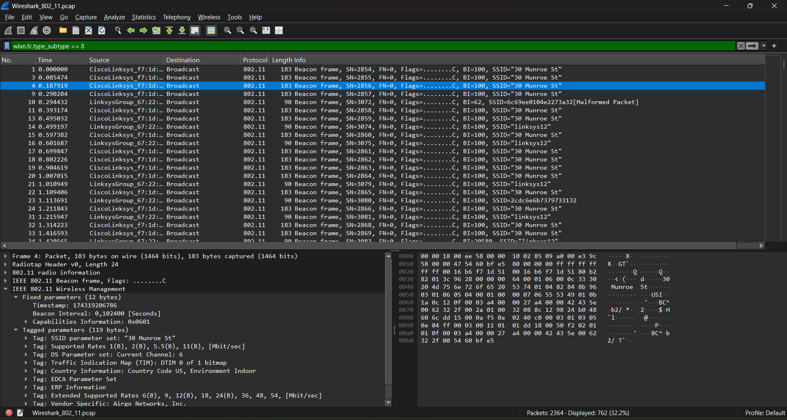
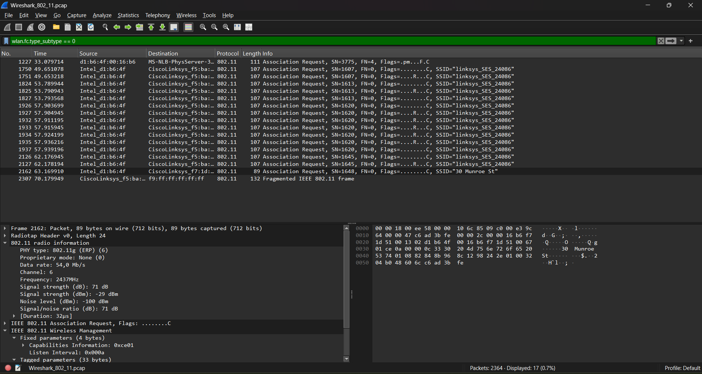
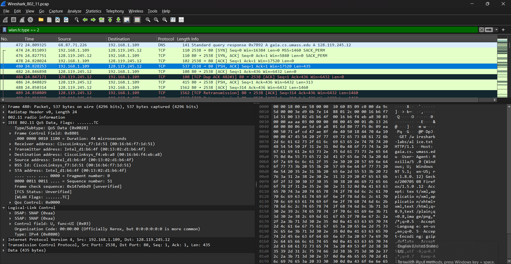
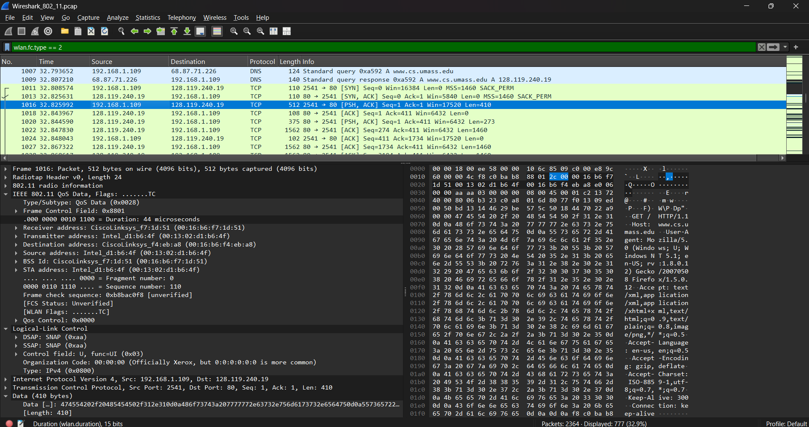
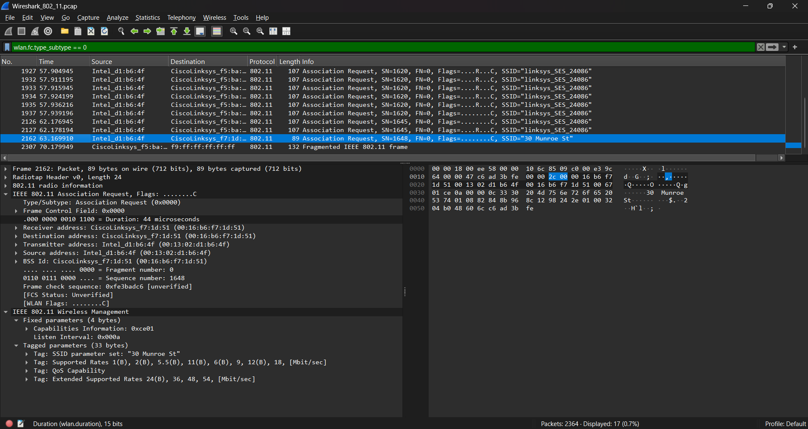
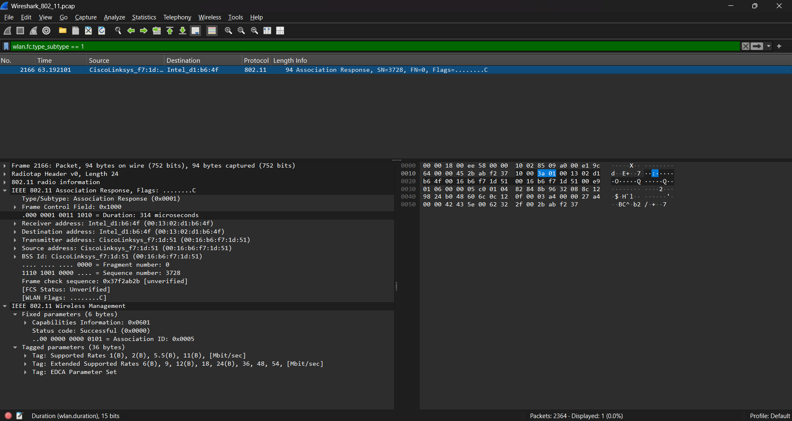

# Laporan Praktikum Jaringan Komputer - Modul 14
## 802.11 WiFi

> **Semester Genap 2025/2026 | Fakultas Informatika | Universitas Telkom**

---

### Identitas Praktikan

## **Nama Lengkap** Muhammad Chaesar Pratama
## **NIM** 103072400119
## **Kelas** IF-04-01

---

## 1. Tujuan Praktikum

### 1. Menginvestigasi cara kerja WiFi menggunakan Wireshark
Mahasiswa dapat menginvestigasi cara kerja WiFi menggunakan Wireshark, khususnya dalam menganalisis protokol jaringan nirkabel 802.11.

---

## 2. Dasar Teori

### 2.1 Pengantar Protokol 802.11
Di lab ini, kami akan menyelidiki protokol jaringan nirkabel 802.11. Karena kita akan menggali lebih dalam 802.11 daripada yang tercakup dalam teks, ada beberapa referensi penting seperti "A Technical Tutorial on the 802.11Protocol" dan “Understanding 802.11 Frame Types”. Serta, tentu saja, standar itu sendiri, "ANSI/IEEE Std 802.11, 1999 Edition (R2003)".

Secara khusus, Tabel 1 pada halaman 36 dari standar tersebut sangat berguna ketika melihat melalui jejak nirkabel. Di semua lab Wireshark sejauh ini, penangkapan frame dilakukan pada koneksi Ethernet kabel. Di sini, karena 802.11 adalah protokol lapisan tautan nirkabel, kita menangkap bingkai "di udara." Karena beberapa driver perangkat untuk NIC 802.11 nirkabel masih tidak menyediakan kait untuk menangkap frame 802.11, praktikum ini menggunakan file jejak yang sudah diambil.

---

## 3. Praktikum WiFi 802.11

### 3.1 Persiapan dan Starting (Langkah Kerja)

**Langkah Kerja:**
1. Download file zip `http://gaia.cs.umass.edu/wireshark-labs/wireshark-traces.zip` dan ekstrak file `Wireshark_802_11.pcap`.
2. Buka file jejak `Wireshark_802_11.pcap` menggunakan Wireshark (melalui menu *File -> Open*).
3. Analisis paket-paket nirkabel yang tertangkap di dalam file jejak tersebut.

Jejak ini dikumpulkan menggunakan AirPcap dan Wireshark yang berjalan di komputer di jaringan rumah, yang terdiri dari titik akses/router gabungan Linksys 802.11g, dengan dua PC berkabel dan satu PC host nirkabel yang terpasang ke AP. Bingkai ditangkap di saluran 6.

### 3.2 Aktivitas Host dalam Jejak

Aktivitas host nirkabel yang diambil dalam file jejak:
- Host sudah diasosiasikan dengan AP `30 Munroe St` saat pelacakan dimulai.
- Pada `t = 24.82`, host membuat permintaan HTTP ke `http://gaia.cs.umass.edu/wireshark-labs/alice.txt` (IP: `128.119.245.12`).
- Pada `t = 32.82`, host membuat permintaan HTTP ke `http://www.cs.umass.edu` (IP: `128.119.240.19`).
- Pada `t = 49.58`, host memutuskan sambungan dari AP `30 Munroe St` dan mencoba menyambung ke `linksys_ses_24086`. Ini bukan titik akses terbuka, dan host akhirnya tidak dapat terhubung.
- Pada `t = 63.0` tuan rumah menyerah mencoba untuk mengasosiasikan dengan AP `linksys_ses_24086`, dan mengasosiasikan lagi dengan AP `30 Munroe St`.

**Hasil Eksekusi Awal:**

*Figure 14.1 Wireshark window, setelah membuka file Wireshark_802_11.pcap*

---

## 4. Analisis Frame Nirkabel

### 4.1 Beacon Frames

**Hasil Pengamatan:**
Bingkai suar (Beacon Frames) digunakan oleh 802.11 AP untuk mengiklankan keberadaannya. Untuk menjawab pertanyaan lab, detail frame dan subbidang “IEEE 802.11” dapat dilihat di jendela Wireshark tengah. 

*Gambar: Tangkapan paket Beacon Frame dari SSID "30 Munroe St"*

Dari gambar di atas, terlihat paket bertipe `Beacon frame` dengan detail parameter SSID, rates yang didukung, dan *Channel* transmisi (misalnya Channel 6). Frame ini bertugas menginformasikan kepada perangkat di sekitarnya mengenai keberadaan jaringan wireless.

---

### 4.2 Data Transfer

**Hasil Pengamatan:**
Karena pelacakan dimulai dengan host yang sudah diasosiasikan dengan AP, transfer data awal melalui asosiasi 802.11 dapat diamati sebelum melihat proses asosiasi/disasosiasi:

- **Pada `t = 24.82`**, HTTP GET dikirim ke `128.119.245.12` (gaia.cs.umass.edu).

- **Pada `t = 32.82`**, HTTP GET dikirim ke `128.119.240.19` (www.cs.umass.edu).

Pada kedua tangkapan tersebut, terlihat bahwa protokol yang menampung pertukaran datanya adalah *IEEE 802.11 QoS Data*. Di dalam data link layer (802.11) ini, terdapat enkapsulasi protokol IP dan TCP yang mengangkut *payload* berisi HTTP request. Teks HTTP (*GET /...*) dapat dibaca pada bagian bawah inspeksi *payload* data.

---

### 4.3 Association/Disassociation

**Hasil Pengamatan:**
Asosiasi di 802.11 dilakukan menggunakan frame request dan response:

- **ASSOCIATE REQUEST**: dikirim dari host ke AP, dengan tipe frame `0` dan subtipe `0`.

*Gambar: Host mengirim permintaan koneksi (Association Request) ke AP "30 Munroe St".*

- **ASSOCIATE RESPONSE**: dikirim oleh AP ke host dengan tipe frame `0` dan subtipe `1` (sebagai tanggapan atas permintaan).

*Gambar: AP memberikan balasan berupa Association Response dengan Status code "Successful (0x0000)".*

Proses ini merupakan *handshake* yang wajib dilakukan oleh *wireless client* pada layer 2 (MAC) agar bisa bergabung ke dalam BSS (jaringan WiFi) AP tersebut.

---

## 5. Kesimpulan

Dari praktikum analisis protokol 802.11 WiFi ini, dapat disimpulkan bahwa Wireshark mampu menangkap dan membedah trafik komunikasi pada jaringan nirkabel (Wireless LAN). Kita dapat melihat bagaimana sebuah Access Point (AP) secara periodik memancarkan **Beacon frames** untuk mengumumkan eksistensi layanannya (SSID dan channel). Ketika perangkat pengguna (host) ingin bergabung, maka akan terjadi pertukaran **Association Request** dari host dan dibalas **Association Response** oleh AP yang menandakan koneksi layer 2 sukses terjalin.

Setelah asosiasi selesai, barulah transmisi data aplikasi (seperti request web HTTP) dapat terjadi. Data tersebut dikirim dengan dibungkus ke dalam **802.11 QoS Data frame**, di mana mekanisme pengirimannya bekerja mengangkut IP dan TCP menyerupai transmisi pada kabel jaringan standar (Ethernet), namun melalui media transmisi tanpa kabel.

---
