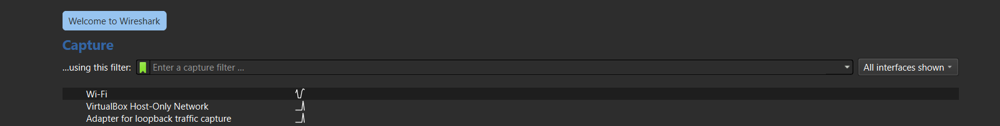
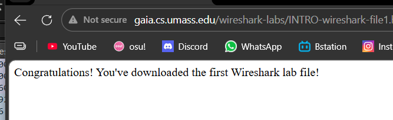

# Laporan Praktikum Jarkom IF-04-01

# Tujuan Praktikum
Untuk menggali dan mengetahui cara kerja serta apa saja kegunaan dari wireshark

## Langkah Percobaan
1. Lakukan instalasi wireshark.
2. hubungkan prangkat yang digunakan ke wi-fi.
3. Buka aplikasi wireshark.
4. pada pilihan jaringan  pilih wi-fi.
5. Lalu akan terlihat Disana trafik paket jaringan dengan detail seperti alamat IP,protokol,waktu,panjang,info.
6. Jalankan https://forms.office.com/r/cHLgrawdBL pada browser.
7. pastikan format link yang berjalan merupakan HTTP dan bukan HTTPS.
8. Pause wireshark.
9. Lakukan pencarian "HTTP" pada kolom pencarian.
10. Jika berhasil maka akan muncul riwayat link yang tadi sudah dijalankan.

## Lampiran
Hasil Percobaan:

## Kesimpulan
Melalui praktikum Modul 2 ini, dapat disimpulkan bahwa Wireshark adalah *tools* yang sangat efektif untuk melakukan *monitoring* dan analisis lalu lintas jaringan. Praktikan dapat memahami cara kerja Wireshark dalam menangkap paket (*packet sniffing*) pada antarmuka jaringan (Wi-Fi), serta dapat memfilter protokol tertentu (seperti HTTP) untuk melihat aktivitas pertukaran data secara lebih spesifik, seperti merekam *request* dan *response* saat mengakses sebuah tautan web.