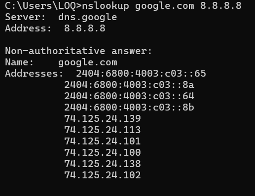
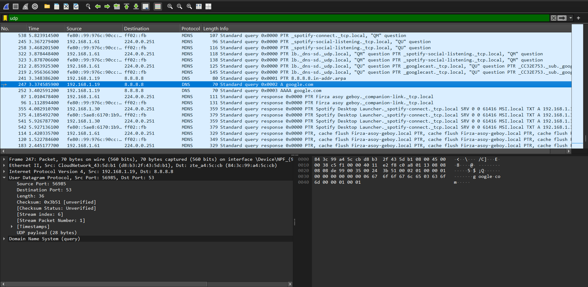

# Laporan Praktikum Jaringan Komputer
## Modul 5: UDP

**Nama:** Muhammad Chaesar Pratama
**NIM:** 103072400119
**Kelas:** IF-04-01
**Minggu / Modul Ke-:** 5

---

#### 5.1 Investigasi Protokol dan Header UDP
**Tujuan:** Menginvestigasi cara kerja protokol *User Datagram Protocol* (UDP) serta menganalisis struktur *header* dan panjang *field*-nya menggunakan alat analisis jaringan Wireshark.

**Bukti *Screenshot* Pelaksanaan:**
*1. Pemicuan Trafik UDP melalui Command Prompt (DNS Query):*

*2. Hasil Tangkapan Paket UDP pada Wireshark:*

**Analisis Caps dan Jawaban Pertanyaan:**
Berdasarkan hasil tangkapan paket UDP pada Wireshark (Frame 247), berikut adalah analisis dari *header* UDP tersebut:

1. **Jumlah dan Nama Field pada Header UDP:** Terdapat tepat **4 *field*** utama di dalam *header* UDP yang terdeteksi pada panel detail paket, yaitu:
   * *Source Port* (Port Sumber: 56985)
   * *Destination Port* (Port Tujuan: 53)
   * *Length* (Panjang: 36)
   * *Checksum* (0x3b51)
2. **Panjang Masing-masing Field:** Masing-masing dari keempat *field* tersebut memiliki panjang **2 byte** (atau 16 bit). Karena terdapat 4 *field*, maka total ukuran keseluruhan dari *header* UDP bersifat tetap, yaitu 8 byte.
3. **Makna Nilai "Length":** Nilai yang tertera pada *field* *Length* menyatakan total panjang segmen UDP secara keseluruhan dalam satuan byte (gabungan dari panjang *header* dan data/*payload*). 
   *Verifikasi pada Wireshark:* Pada *screenshot* nilai *Length* menunjukkan angka **36**. Jika dikurangi dengan ukuran *header* UDP yang sebesar 8 byte, maka didapatkan ukuran data asli sebesar 36 - 8 = **28 byte**. Hal ini terbukti akurat dan sesuai dengan keterangan **"UDP payload (28 bytes)"** yang ada di bawah bagian *checksum*.
4. **Jumlah Maksimum Byte pada Payload UDP:** Karena *field* *Length* berukuran 2 byte (16 bit), nilai maksimum yang dapat ditampungnya adalah $2^{16} - 1 = 65535$ byte. Karena *header* UDP selalu mengambil ruang sebesar 8 byte, maka ukuran maksimum *payload* (data) yang dapat disertakan dalam satu segmen UDP adalah **65527 byte** (65535 - 8).
5. **Nomor Port Sumber Terbesar:** Sama halnya dengan *field Length*, *field Source Port* juga berukuran 2 byte (16 bit). Oleh karena itu, port sumber terbesar yang dapat digunakan secara teoretis adalah **65535**.
6. **Nomor Protokol UDP pada IP Datagram:** Dengan menginspeksi *header Internet Protocol* Version 4 (IPv4) yang membungkus segmen UDP ini, terlihat pada *field "Protocol"* bahwa nomor protokol untuk UDP adalah **17** dalam notasi desimal atau **0x11** dalam notasi heksadesimal.
7. **Analisis Pasangan Paket UDP (Request & Reply):** Pada *trace* jaringan ini, Frame 247 merupakan paket *Request* yang dikirim dari *host* (`192.168.1.19`) menuju DNS Server Google (`8.8.8.8`) dengan *Source Port* 56985 dan *Destination Port* 53. Ketika DNS Server mengirimkan balasan (*Reply*), terjadi pertukaran pasangan port di mana *Source Port* paket balasan akan berubah menjadi 53 dan *Destination Port*-nya menjadi 56985 untuk memastikan data kembali ke aplikasi yang tepat.

### Kesimpulan
Berdasarkan investigasi pada Modul 5 mengenai protokol UDP menggunakan Wireshark, dapat disimpulkan bahwa:

1. **Sifat Sederhana UDP:** Berbeda dengan TCP, UDP adalah protokol *transport* yang sangat sederhana (*lightweight*). Hal ini dibuktikan dengan ukuran *header*-nya yang sangat kecil, yakni hanya 8 byte, yang terdiri dari *Source Port, Destination Port, Length*, dan *Checksum*.
2. **Efisiensi Overhead:** Karena ukuran *header* yang kecil dan tidak adanya mekanisme jabat tangan (*handshake*) atau jaminan pengiriman, UDP memiliki *overhead* yang sangat rendah, sehingga ideal untuk aplikasi yang membutuhkan kecepatan tinggi dan toleran terhadap sedikit kehilangan data (seperti *streaming* atau DNS).
3. **Batas Ukuran Transmisi:** Segmen UDP dikontrol oleh *field* yang berukuran 16-bit, yang berarti protokol ini secara teoretis membatasi ukuran maksimal port pada angka 65535 dan ukuran maksimal *payload* pada 65527 byte per datagram.