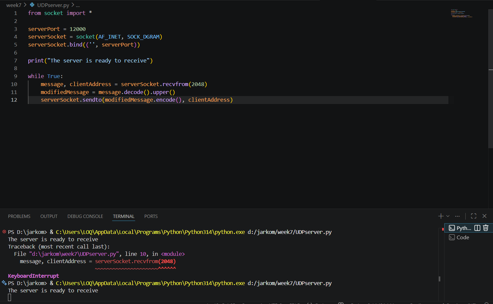
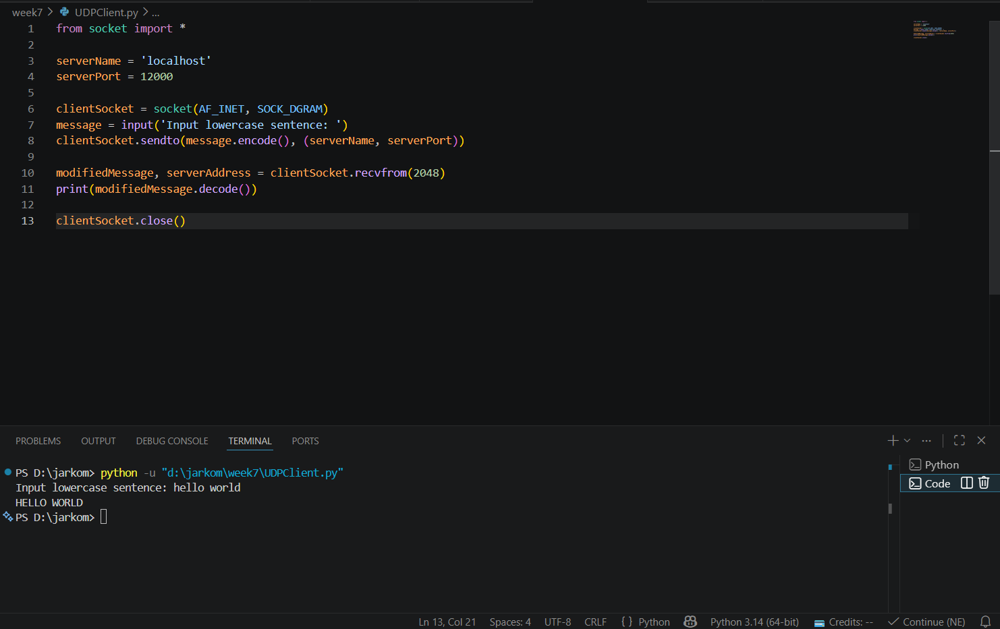
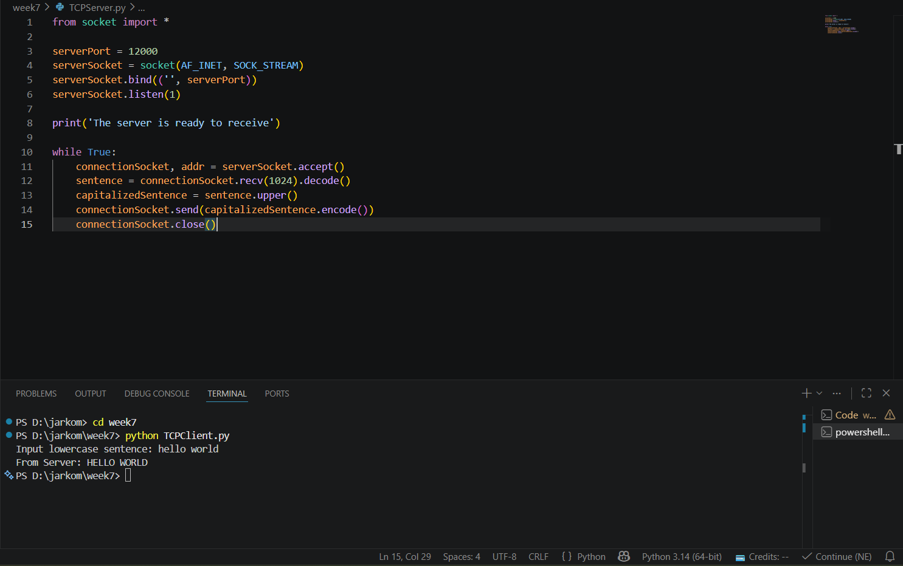
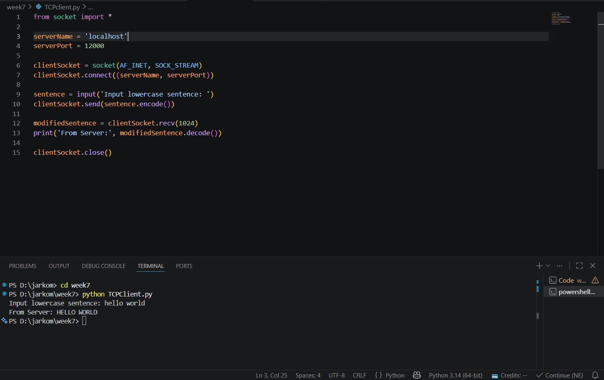

# Laporan Praktikum Jaringan Komputer - Modul 7
## Socket Programming: UDP dan TCP

> **Semester Genap 2025/2026 | Fakultas Informatika | Universitas Telkom**

---

### Identitas Praktikan

## **Nama Lengkap** Muhammad Chaesar Pratama
## **NIM** 103072400119
## **Kelas** IF-04-01

---

## 1. Tujuan Praktikum

### 1. Membuat aplikasi client-server UDP
Memahami implementasi socket UDP untuk komunikasi tanpa koneksi

### 2. Membuat aplikasi client-server TCP
Memahami implementasi socket TCP dengan mekanisme koneksi

### 3. Memahami perbedaan UDP dan TCP
Mengetahui karakteristik dan use case masing-masing protokol

### 4. Menganalisis pertukaran data
Mampu melacak alur komunikasi antara client dan server

---

## 2. Dasar Teori

### 2.1 Konsep Socket Programming

| Istilah | Definisi |
|---------|----------|
| **Socket** | Endpoint untuk komunikasi jaringan antara dua program |
| **Client** | Aplikasi yang memulai permintaan/koneksi ke server |
| **Server** | Aplikasi yang menunggu dan melayani permintaan client |
| **Binding** | Proses mengaitkan socket dengan alamat IP dan port tertentu |
| **Listen** | Server dalam mode siap menerima koneksi masuk |
| **Accept** | Server menerima koneksi dari client dan membuat socket khusus |
| **Connect** | Client memulai proses koneksi ke server |

### 2.2 Perbandingan UDP dan TCP

| Karakteristik | UDP | TCP |
|--------------|-----|-----|
| **Jenis Protokol** | Connectionless | Connection-oriented |
| **Handshake** | Tidak ada | 3-way handshake (SYN, SYN-ACK, ACK) |
| **Keandalan** | Tidak dijamin | Dijamin (ACK, retransmission) |
| **Urutan Data** | Tidak dijamin | Dijamin berurutan |
| **Overhead Header** | 8 byte | 20+ byte |
| **Kecepatan** | Lebih cepat | Ada delay handshake |
| **Flow Control** | Tidak ada | Ada (windowing mechanism) |
| **Use Case** | DNS, streaming, gaming | Web, email, file transfer |

---

## 3. Praktikum UDP Socket

### 3.1 Kode Program UDP Server

**File:** `UDPServer.py`

```python
from socket import *

serverPort = 12000
serverSocket = socket(AF_INET, SOCK_DGRAM)
serverSocket.bind(('', serverPort))

print("The server is ready to receive")

while True:
    message, clientAddress = serverSocket.recvfrom(2048)
    modifiedMessage = message.decode().upper()
    serverSocket.sendto(modifiedMessage.encode(), clientAddress)
```

**Penjelasan:**
- Server membuat socket UDP dengan `SOCK_DGRAM`
- Bind ke port 12000 agar paket yang masuk ke port tersebut diarahkan ke socket ini
- Looping terus menerus untuk menerima pesan dari client
- Mengubah pesan menjadi uppercase dan mengirim balik ke alamat client

---

### 3.2 Kode Program UDP Client

**File:** `UDPClient.py`

```python
from socket import *

serverName = 'localhost'
serverPort = 12000

clientSocket = socket(AF_INET, SOCK_DGRAM)
message = input('Input lowercase sentence: ')
clientSocket.sendto(message.encode(), (serverName, serverPort))

modifiedMessage, serverAddress = clientSocket.recvfrom(2048)
print(modifiedMessage.decode())

clientSocket.close()
```

**Penjelasan:**
- Client membuat socket UDP (tidak perlu bind port secara manual)
- Langsung kirim pesan ke server menggunakan `sendto()` beserta alamat tujuan
- Terima response dengan `recvfrom()`
- Tidak memerlukan `connect()` karena UDP bersifat connectionless

---

### 3.3 Hasil Eksekusi UDP

**Langkah Testing:**
1. Buka terminal 1 → jalankan server: `python UDPServer.py`
2. Buka terminal 2 → jalankan client: `python UDPClient.py`
3. Input pesan huruf kecil dan lihat hasilnya

**Terminal 1 - UDP Server:**



Server berjalan dan menunggu pesan dari client.

**Terminal 2 - UDP Client:**



Client mengirim pesan dan menerima response dari server.

**Hasil:**
- Input: `hello world`
- Output dari server: `HELLO WORLD`
- Pesan berhasil dikonversi ke uppercase

---

## 4. Praktikum TCP Socket

### 4.1 Kode Program TCP Server

**File:** `TCPServer.py`

```python
from socket import *

serverPort = 12000
serverSocket = socket(AF_INET, SOCK_STREAM)
serverSocket.bind(('', serverPort))
serverSocket.listen(1)

print('The server is ready to receive')

while True:
    connectionSocket, addr = serverSocket.accept()
    sentence = connectionSocket.recv(1024).decode()
    capitalizedSentence = sentence.upper()
    connectionSocket.send(capitalizedSentence.encode())
    connectionSocket.close()
```

**Penjelasan:**
- Server membuat socket TCP dengan `SOCK_STREAM`
- `listen(1)` → server siap menerima koneksi masuk (max 1 antrian)
- `accept()` → menerima koneksi dari client dan membuat `connectionSocket` baru yang didedikasikan untuk client tersebut
- Setelah selesai melayani, `connectionSocket` ditutup namun `serverSocket` tetap terbuka untuk client berikutnya

---

### 4.2 Kode Program TCP Client

**File:** `TCPClient.py`

```python
from socket import *

serverName = 'localhost'
serverPort = 12000

clientSocket = socket(AF_INET, SOCK_STREAM)
clientSocket.connect((serverName, serverPort))

sentence = input('Input lowercase sentence: ')
clientSocket.send(sentence.encode())

modifiedSentence = clientSocket.recv(1024)
print('From Server:', modifiedSentence.decode())

clientSocket.close()
```

**Penjelasan:**
- Client membuat socket TCP dengan `SOCK_STREAM`
- `connect()` → menginisiasi koneksi ke server (3-way handshake terjadi di sini)
- Kirim data dengan `send()` tanpa perlu menyertakan alamat tujuan karena koneksi sudah terbentuk
- Terima response dengan `recv()`, lalu tutup socket

---

### 4.3 Hasil Eksekusi TCP

**Langkah Testing:**
1. Buka terminal 1 → jalankan TCP server: `python TCPServer.py`
2. Buka terminal 2 → jalankan TCP client: `python TCPClient.py`
3. Input kalimat huruf kecil dan lihat hasilnya

**Terminal 1 - TCP Server:**



Server siap menerima koneksi dan memproses pesan dari client.

**Terminal 2 - TCP Client:**



Client terhubung ke server, mengirim pesan, dan menerima response.

**Hasil:**
- Input: `hello world`
- Output dari server: `HELLO WORLD`
- Koneksi TCP berhasil di-establish sebelum transfer data berlangsung

---

## 5. Perbandingan UDP vs TCP (Hasil Praktikum)

### 5.1 Perbedaan Implementasi

| Aspek | UDP | TCP |
|-------|-----|-----|
| **Socket Type** | `SOCK_DGRAM` | `SOCK_STREAM` |
| **Koneksi** | Tidak perlu `connect()` | Perlu `connect()` |
| **Server Socket** | 1 socket untuk semua client | 2 socket (serverSocket + connectionSocket) |
| **Send / Receive** | `sendto()` / `recvfrom()` | `send()` / `recv()` |
| **Alamat Tujuan** | Harus disertakan tiap kirim | Otomatis (sudah ada koneksi) |

### 5.2 Perbedaan Hasil Eksekusi

| Karakteristik | UDP | TCP |
|--------------|-----|-----|
| **Kecepatan** | Lebih cepat (langsung kirim) | Ada delay handshake |
| **Server** | Handle multiple client simultan | Handle 1 client per waktu |
| **Reliability** | Tidak ada jaminan | Data terjamin sampai |

---

## 6. Analisis

### 6.1 UDP Socket

**Hasil Pengamatan:**
Saat menjalankan program UDP, server langsung dapat menerima pesan dari client tanpa ada proses negosiasi koneksi terlebih dahulu. Pesan yang masuk langsung diproses dalam loop menggunakan `recvfrom()` yang sekaligus mengembalikan alamat pengirim. Server kemudian mengirim balik pesan yang telah dikapitalisasi ke alamat tersebut menggunakan `sendto()`. Seluruh proses berlangsung tanpa handshake, sehingga lebih sederhana namun tidak memiliki mekanisme konfirmasi apakah data benar-benar diterima.

**Keunggulan UDP:**
- Implementasi lebih sederhana, tidak ada overhead koneksi
- Cocok untuk aplikasi real-time yang toleran terhadap kehilangan paket

**Keterbatasan:**
- Tidak ada jaminan pesan sampai ke tujuan
- Tidak ada mekanisme retransmisi atau urutan data

---

### 6.2 TCP Socket

**Hasil Pengamatan:**
Pada program TCP, proses dimulai dengan client memanggil `connect()` yang memicu 3-way handshake di lapisan transport. Setelah koneksi terbentuk, server membuat `connectionSocket` baru yang didedikasikan hanya untuk client tersebut, sedangkan `serverSocket` tetap mendengarkan koneksi baru. Data dikirim dan diterima melalui `connectionSocket`, dan setelah selesai, socket koneksi ditutup. Pendekatan ini menjamin data sampai secara berurutan namun memerlukan lebih banyak langkah dibanding UDP.

**Keunggulan TCP:**
- Reliable delivery dengan jaminan data sampai dan berurutan
- Memiliki mekanisme flow control dan congestion control

**Keterbatasan:**
- Overhead lebih besar akibat proses handshake
- Server perlu threading untuk melayani banyak client secara bersamaan

---

## 7. Kesimpulan

| Aspek | UDP Socket | TCP Socket |
|-------|------------|------------|
| **Implementasi** | Lebih sederhana | Lebih kompleks tapi reliable |
| **Koneksi** | Connectionless | Connection-oriented (3-way handshake) |
| **Delivery** | Tidak ada jaminan | Data terjamin sampai |
| **Urutan Data** | Tidak dijamin | Terjamin berurutan |
| **Prioritas** | Mengutamakan kecepatan | Mengutamakan keandalan |
| **Metode Kirim** | `sendto()` | `send()` |
| **Metode Terima** | `recvfrom()` | `recv()` |
| **Socket Server** | 1 socket untuk semua client | 2 socket (`serverSocket` + `connectionSocket`) |
| **Fungsi Wajib** | Tidak perlu `connect()`/`listen()`/`accept()` | Perlu `connect()`/`listen()`/`accept()` |
| **Use Case** | DNS, Streaming, VoIP, Gaming | Web, Email, File Transfer |

Praktikum ini membuktikan bahwa pemilihan protokol transport (UDP atau TCP) sangat bergantung pada kebutuhan aplikasi. UDP unggul dalam kecepatan untuk aplikasi real-time, sementara TCP dipilih ketika integritas dan urutan data menjadi prioritas utama.

---