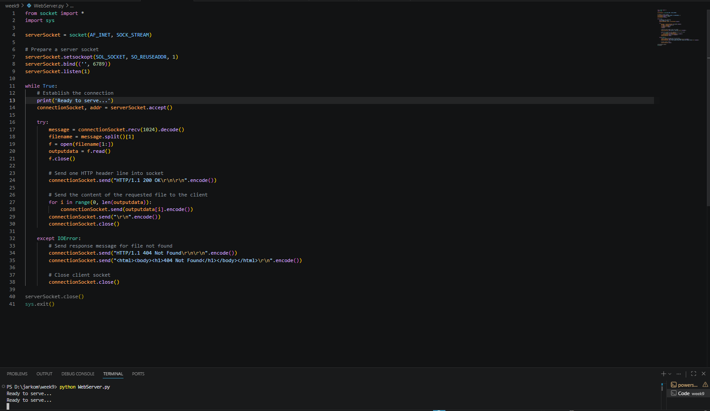
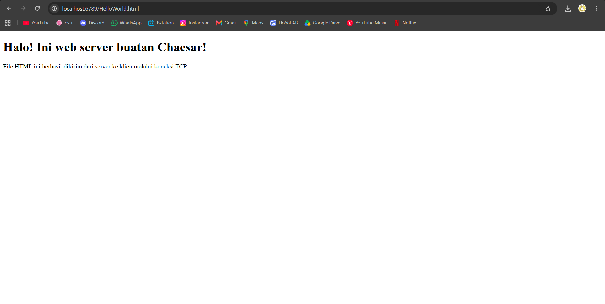
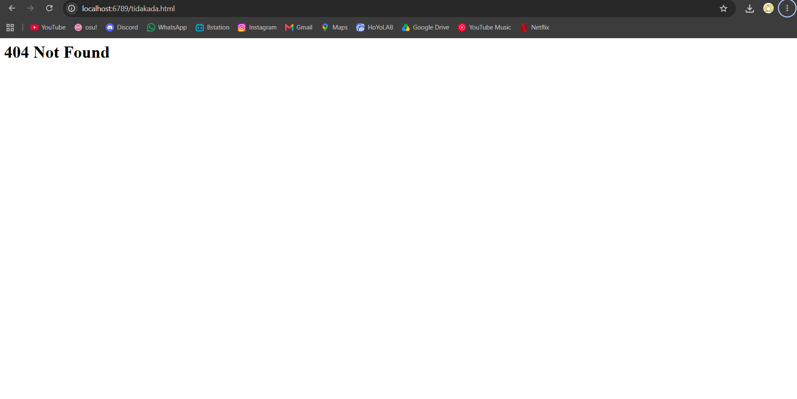

# Laporan Praktikum Jaringan Komputer - Modul 9
## Web Server Sederhana Berbasis TCP Socket

> **Semester Genap 2025/2026 | Fakultas Informatika | Universitas Telkom**

---

### Identitas Praktikan

## **Nama Lengkap** Muhammad Chaesar Pratama
## **NIM** 103072400119
## **Kelas** IF-04-01

---

## 1. Tujuan Praktikum

### 1. Membuat web server sederhana berbasis TCP Socket
Memahami cara kerja server HTTP yang menangani permintaan GET dari browser

### 2. Memahami format pesan HTTP
Mengetahui struktur HTTP request dan HTTP response (header + body)

### 3. Menangani kondisi file ditemukan dan tidak ditemukan
Mengirim respons `200 OK` jika file ada, dan `404 Not Found` jika tidak ada

### 4. Menganalisis komunikasi client-server HTTP
Mampu melacak alur antara browser sebagai client dan server yang dibuat sendiri

---

## 2. Dasar Teori

### 2.1 Konsep Web Server

| Istilah | Definisi |
|---------|----------|
| **Web Server** | Program yang menerima HTTP request dari client dan membalas dengan HTTP response |
| **HTTP Request** | Pesan yang dikirim browser ke server, berisi method (GET), path file, dan header |
| **HTTP Response** | Pesan balasan server yang berisi status code, header, dan isi file |
| **Status 200 OK** | Kode respons yang berarti file berhasil ditemukan dan dikirim |
| **Status 404 Not Found** | Kode respons yang berarti file yang diminta tidak ditemukan di server |
| **Port 6789** | Port yang digunakan server dalam praktikum ini (bukan port standar 80) |
| **Socket TCP** | Soket `SOCK_STREAM` yang digunakan karena HTTP berjalan di atas TCP |

### 2.2 Alur Kerja Web Server

| Langkah | Proses |
|---------|--------|
| **1** | Server bind ke port 6789 dan listen |
| **2** | Browser mengirim HTTP GET request ke server |
| **3** | Server menerima request dan mengurai nama file yang diminta |
| **4** | Server mencoba membuka file tersebut di direktorinya |
| **5a** | Jika file ada → kirim `200 OK` + isi file |
| **5b** | Jika file tidak ada → kirim `404 Not Found` |
| **6** | Server menutup connection socket, kembali menunggu request baru |

---

## 3. Kode Program Web Server

### 3.1 Kode Lengkap `WebServer.py`

```python
from socket import *
import sys

serverSocket = socket(AF_INET, SOCK_STREAM)

# Prepare a server socket
serverSocket.setsockopt(SOL_SOCKET, SO_REUSEADDR, 1)
serverSocket.bind(('', 6789))
serverSocket.listen(1)

while True:
    # Establish the connection
    print('Ready to serve...')
    connectionSocket, addr = serverSocket.accept()

    try:
        message = connectionSocket.recv(1024).decode()
        filename = message.split()[1]
        f = open(filename[1:])
        outputdata = f.read()
        f.close()

        # Send one HTTP header line into socket
        connectionSocket.send("HTTP/1.1 200 OK\r\n\r\n".encode())

        # Send the content of the requested file to the client
        for i in range(0, len(outputdata)):
            connectionSocket.send(outputdata[i].encode())
        connectionSocket.send("\r\n".encode())
        connectionSocket.close()

    except IOError:
        # Send response message for file not found
        connectionSocket.send("HTTP/1.1 404 Not Found\r\n\r\n".encode())
        connectionSocket.send("<html><body><h1>404 Not Found</h1></body></html>\r\n".encode())

        # Close client socket
        connectionSocket.close()

serverSocket.close()
sys.exit()
```

---

### 3.2 Penjelasan Bagian Fill-In

| Bagian | Kode yang Diisi | Penjelasan |
|--------|----------------|------------|
| Prepare server socket | `serverSocket.bind(('', 6789))` + `serverSocket.listen(1)` | Bind ke port 6789, lalu listen untuk koneksi masuk |
| Accept connection | `serverSocket.accept()` | Menunggu dan menerima koneksi dari client, menghasilkan connectionSocket |
| Terima request | `connectionSocket.recv(1024).decode()` | Membaca HTTP request dari browser |
| Baca file | `f.read()` | Membaca seluruh isi file yang diminta |
| Kirim header sukses | `"HTTP/1.1 200 OK\r\n\r\n".encode()` | Mengirim HTTP response header 200 |
| Kirim header 404 | `"HTTP/1.1 404 Not Found\r\n\r\n".encode()` | Mengirim HTTP response header 404 |
| Tutup client socket | `connectionSocket.close()` | Menutup koneksi setelah respons dikirim |

---

## 4. File HTML untuk Pengujian

### 4.1 Kode `HelloWorld.html`

```html
<!DOCTYPE html>
<html>
<head>
    <title>Hello World</title>
</head>
<body>
    <h1>Hello, World!</h1>
    <p>Web server berhasil berjalan.</p>
</body>
</html>
```

Simpan file ini di folder yang sama dengan `WebServer.py`.

---

## 5. Hasil Eksekusi

### 5.1 Langkah Testing

1. Pastikan `WebServer.py` dan `HelloWorld.html` berada di folder yang sama
2. Jalankan server di terminal:
   ```
   python WebServer.py
   ```
3. Buka browser, akses URL:
   ```
   http://localhost:6789/HelloWorld.html
   ```
4. Untuk menguji 404, akses file yang tidak ada:
   ```
   http://localhost:6789/tidakada.html
   ```

---

### 5.2 Terminal — Web Server Berjalan



Server menampilkan `Ready to serve...` setiap kali siap menerima request baru dari browser.

---

### 5.3 Browser — Hasil 200 OK (File Ditemukan)



Browser berhasil menampilkan isi `HelloWorld.html` yang diambil dari server.

---

### 5.4 Browser — Hasil 404 Not Found (File Tidak Ada)



Browser menampilkan pesan 404 Not Found karena file yang diminta tidak ditemukan di server.

---

## 6. Analisis

### 6.1 Proses HTTP Request dan Response

Ketika browser mengakses `http://localhost:6789/HelloWorld.html`, browser secara otomatis membentuk HTTP GET request seperti berikut:

```
GET /HelloWorld.html HTTP/1.1
Host: localhost:6789
...
```

Server menerima teks request ini via `recv()`, lalu memecahnya dengan `split()[1]` untuk mengambil path `/HelloWorld.html`. Karakter `/` di depan dihilangkan menggunakan `filename[1:]` sehingga menjadi `HelloWorld.html`, yang kemudian dibuka langsung dari sistem file.

### 6.2 Penanganan 200 OK

Jika file berhasil dibuka, server mengirim header `HTTP/1.1 200 OK\r\n\r\n` terlebih dahulu, diikuti isi file karakter per karakter menggunakan loop. Browser menginterpretasikan respons ini dan merender HTML yang diterima.

### 6.3 Penanganan 404 Not Found

Jika file tidak ditemukan, Python melempar `IOError` yang ditangkap oleh blok `except`. Server kemudian mengirim header `HTTP/1.1 404 Not Found` beserta body HTML sederhana sebagai pesan error kepada browser.

### 6.4 Peran `SO_REUSEADDR`

Opsi `setsockopt(SOL_SOCKET, SO_REUSEADDR, 1)` ditambahkan agar port 6789 bisa langsung digunakan kembali saat server di-restart, tanpa menunggu timeout sistem operasi melepas port tersebut.

---

## 7. Kesimpulan

| Aspek | Hasil Praktikum |
|-------|----------------|
| **Protokol** | Web server menggunakan TCP Socket (`SOCK_STREAM`) sebagai transport |
| **Port** | Server berjalan di port 6789, bukan port HTTP standar 80 |
| **Request Parsing** | Path file diambil dari HTTP request menggunakan `split()[1]` |
| **Respons 200** | Header `HTTP/1.1 200 OK` + isi file dikirim jika file ditemukan |
| **Respons 404** | Header `HTTP/1.1 404 Not Found` + body error dikirim jika file tidak ada |
| **Error Handling** | `IOError` dari `open()` dimanfaatkan sebagai trigger pengiriman 404 |
| **Loop Server** | Server menggunakan `while True` agar dapat melayani request berulang |

Praktikum ini membuktikan bahwa web server pada dasarnya adalah socket TCP yang memahami format HTTP: menerima teks request, membaca file dari disk, lalu mengirim respons berformat HTTP kembali ke browser.

---